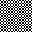

# QR Radiation

An optimizer that makes your QR code look like a target graphic by manipulating your URL.

## Examples

By running this program with various target PNG images, it created the below QR codes. Each one points to https://phor.net website, try it.

|  |  |  |  |  |
| ------------------------------------------------------------ | ------------------------------------------------------------ | ------------------------------------------------------------ | ------------------------------------------------------------ | ------------------------------------------------------------ |
|  |  |  |  |  |

## Installation

1. Install Node JS 14+

2. Install dependencies:
   ```sh
   yarn install
   ```

## Run

1. Choose a base URL you would like to link to. Set that in **config.json** under `prefix`.

2. Choose a QR version (pixel size) you want. Set that in **config.json** under `version`.

3. Add or subtract random digits on `suffix` to be as many as you can fit without getting an error.

4. Save a PNG image to **target.png** that is the correct size in pixels as per your QR version.

5. Run the command
   ```sh
   node index.mjs
   ```

Now you will see various improvements to `suffix` spit out on the console along with a loss function that goes down. This loss function compares **target.png** versus the proposed URL.

Stop any time, killing the command with <kbd>CTRL</kbd>-<kbd>C</kbd>. The output file **best.png** shows the QR code for the best URL.

To resume progress, take the last suffix from your terminal output and paste it back into your **config.json** under `suffix`.

## Contributing

This project was fun. And I make a lot of QR codes, so it is useful to me.

Please do not create issues, I am not interested in maintaining this. But if you have a major improvement to share, I would be happy to review your contribution as a PR.

## References

- [my-qr.art](https://github.com/raatmarien/my-qr.art/issues/6)—A project that (mostly) lets you set specific QR pixels, but you don't control the URL and you can set certain areas
- [Thonky](https://www.thonky.com/qr-code-tutorial/)—The best QR specification
- [QR Decode](http://qrlogo.kaarposoft.dk/qrdecode.html)—Nice QR reader/debugger
- [QRazyBox](https://merricx.github.io/qrazybox/)—Forensic decoding of damaged QR codes
